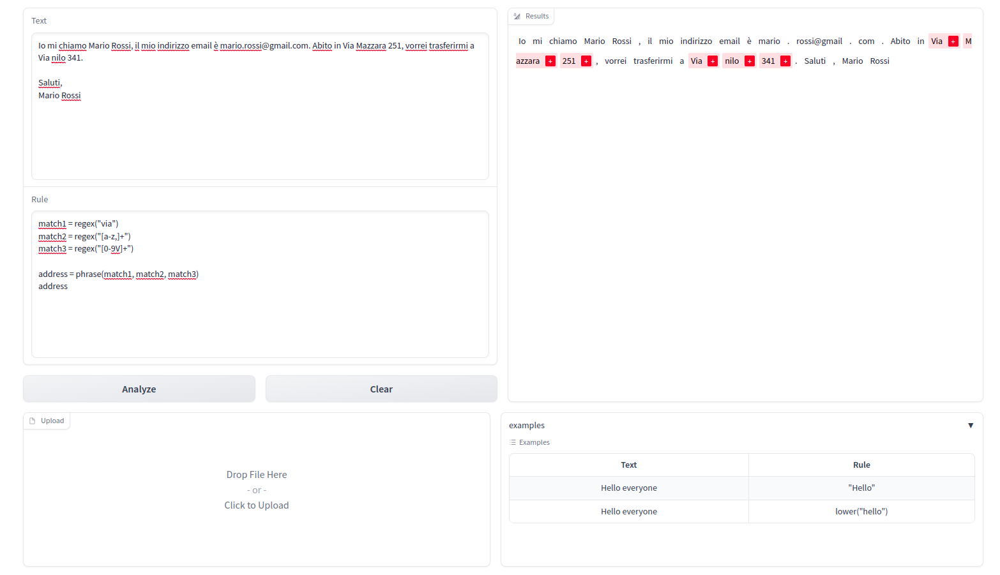
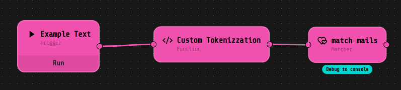
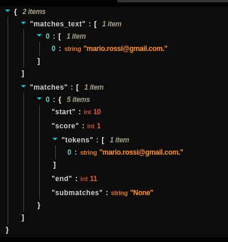
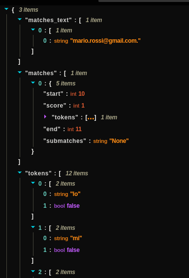

# 📦 MATCHER - Entity Extraction Component

MATCHER is a versatile component designed for extracting entities from documents using customizable rules. It's equipped with a range of specific objects tailored to various research needs. 🕵️‍♂️

## 📝 Description

MATCHER is your go-to tool when you need to extract specific information from textual data. It operates by defining rules and patterns to identify and extract entities. These extracted entities can be as simple as individual tokens or more complex combinations. 

Matcher objects work by processing a list of tokens generated from the input text using a tokenizer. These tokens are then validated against specific criteria using checkers. Alternatively, you can directly pass a tokenized text, if you want to customize the sentences tokenization.

### 💻  How to Use MATCHER GUI
MATCHER GUI provides an intuitive interface for extracting entities from text using MATCHER's powerful capabilities. Follow these simple steps to extract matching tokens from your input text:

- Insert the text that you want to analyze in to the _Text_ field as shown in the image below, or upload a _.txt_ file through drag-dropping it or directly uploading it from your file system;
- Add the rules you want to apply on your text;
- Click on the "Analyze" button,  This button initiates the analysis process, where MATCHER will process your text and identify matching tokens based on the rules you've configured.

Finally, the GUI will display the results of the analysis: the resulting text will be presented with matching tokens highlighted in red.

If you don't know how to start, to the bottom-right side of the GUI you can find few easy examples that may help you to understand how it works. 

## 🔧 Configuration

It's possible to fine-tune Matcher's behavior using different types of matchers. You can also decide to stack multiple matchers to obtain a specific matching rule.
- [Individual Tokens](#individual-tokens)
- [Multi-Token Matchers](#multi-token-matchers)
- [Choice of Different Conditions](#choice-of-different-conditions)
- [Normalization of Tokens](#normalization-of-tokens)
- [Filter Functions](#filter-functions)
- [Post-Processing](#post-processing)
- [Custom Functions](#custom-functions)

### [Individual Tokens](#individual-tokens)
🔹 **Simple Matcher:** Used to match a specific tokens.

🔹 **Regex Matcher:** Allows tokens matching using regular expressions.

🔹 **Fuzzy Matcher:** Matches tokens by analogy, with a defined threshold.

🔹 **Syn Matcher:** Matches any of the specified tokens.

🔹 **All Matcher:** Returns all individual tokens in the document.

🔹 **Condition Matcher:** Requires a condition and is used in combination with other matchers.

### [Multi-Token Matchers](#multi-token-matchers)

🔹 **Span Matcher:** Matches a range of tokens based on minimum and maximum values.

🔹 **Phrase Matcher:** Matches tokens sequentially respecting all specified matchers.

🔹 **Perm Matcher:** Similar to the Phrase Matcher, but order doesn't matter.

🔹 **Rep Matcher:** Repeats the match until tokens meet specified conditions.

🔹 **Skip Matcher:** Returns tokens within a specified range that meet certain conditions.
 
🔹 **Expand Matcher:** Matches tokens within a defined range of a given token.

🔹 **Context Matcher:** Returns all tokens within a context bounded by specified matchers.

### [Choice of Different Conditions](#choice-of-different-conditions)

🔹 **Oneof Matcher:** Matches tokens that meet at least one of the specified matchers.

🔹 **Backoff Matcher:** Returns the first match and ignores the others in a series of matchers.

🔹 **Chain Matcher:** Applies the second matcher to tokens extracted from the first, often used with Expand, Skip, and Context matchers.

### [Normalization of Tokens](#normalization-of-tokens)

🔹 **Norm Matcher:** Normalizes tokens using a specified function.

🔹 **Lower Matcher:** Converts tokens to lowercase for consistency.

### [Filter Functions](#filter-functions)

🔹 **Filter Matcher:** Applies a filter to the matched tokens based on a boolean condition.

🔹 **Expandfilter Matcher:** Allows applying a filter to tokens outside of an initial matcher.

### [Post-Processing](#post-processing)

🔹 **Exclude Matcher:** Tokens that match the condition within the object won't be displayed within the candidates.

🔹 **Post Matcher:** Applies a function to tokens for display purposes.

### [Custom Functions](#custom-functions)

🔹 Within the Matcher component, you have the flexibility to craft your personalized functions using **Python code**.

##  🔄 Example Flow

In the image above, you'll find an illustrative flow. In this scenario, we've simulated the text content, proceeded to tailor the tokenization process by segmenting tokens based on spaces. Afterward, utilizing the regex matcher, we applied a straightforward rule to identify email addresses.

The content of the components is _"regex("^\S+@\S+$")"_, but could also have been something like _"return regex("^\S+@\S+$")"_, since it can contain python code. 

### 📤 Output of the Matcher component

The output of the block usually consists of two keys `matches` and `matches_text`. If the field "Include Tokens Information" is toogled, the key "tokens" will also be present, so that you can check if the tokenization is alligned to your expectation. The output keys represent:

- `Tokens` provide the tokenization of the input text, with a boolean indicating whether each token is part of a match.

- `Matches` are represented as a list, each containing the position of the first and last token, the matching score achieved (usefull for the similarity/fuzzy matcher), submatches, and the list of tokens that make up the match.

- `Matches_text` represent the list of tokens that make up the match.

  
